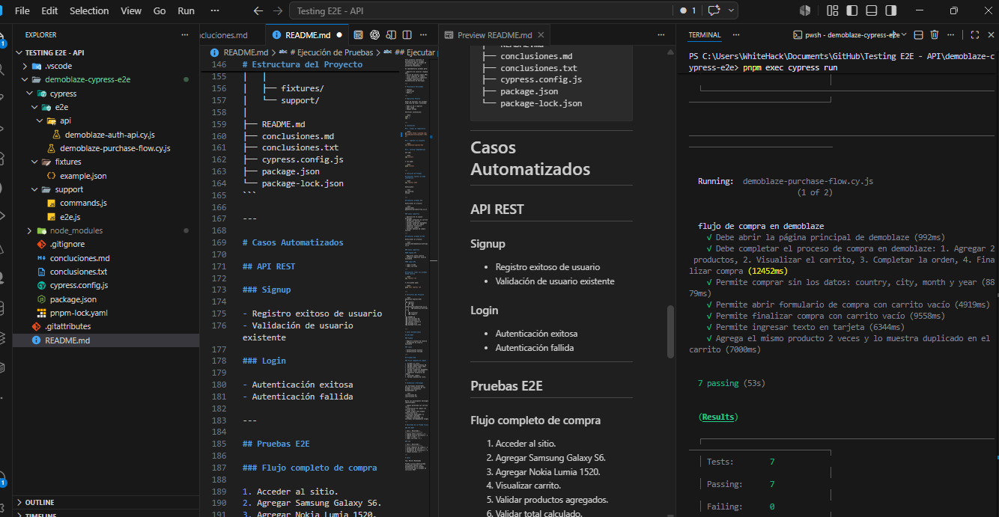
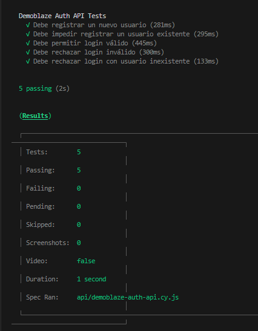
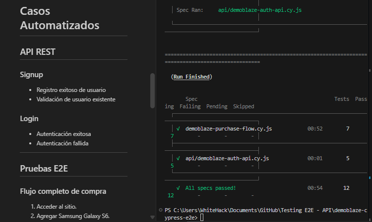

# QA Automation E2E - Demoblaze

Información General

Framework utilizado: Cypress

Tipo de prueba: End-to-End (E2E)

Sitio evaluado: https://www.demoblaze.com/

Objetivo: : Automatizar el flujo completo de compra validando el comportamiento funcional de la aplicación y documentar los hallazgos encontrados durante la ejecución de las pruebas.

# Escenarios Automatizados

## Caso 1 - Acceso a la página principal

Objetivo: 

Verificar que la página principal se encuentre disponible.

Resultado Esperado

La aplicación muestra correctamente la página principal y el texto PRODUCT STORE.

Resultado

Aprobado.

---

## Caso 2 - Flujo completo de compra

Objetivo: 

Validar el flujo principal de compra.

Pasos ejecutados

1. Abrir la página principal.
2. Agregar Samsung Galaxy S6 al carrito.
3. Agregar Nokia Lumia 1520 al carrito.
4. Visualizar el carrito.
5. Validar los productos agregados.
6. Validar el total calculado.
7. Abrir el formulario de compra.
8. Completar los datos requeridos.
9. Finalizar la compra.
10. Validar el mensaje de confirmación.

Resultado Esperado

La compra se realiza exitosamente.

Resultado

Aprobado.

---

## Caso 3 - Compra con campos obligatorios vacíos

Objetivo: 

Validar el comportamiento cuando no se completan los campos requeridos.

Resultado Observado: 

La aplicación muestra una alerta indicando que Name y Credit Card son obligatorios.

Resultado

Aprobado.

---

## Caso 4 - Compra con carrito vacío

Objetivo: 

Validar si el sistema permite finalizar compras sin productos.

Resultado Observado: 

La aplicación permite abrir el formulario de compra aun cuando el carrito se encuentra vacío.

Además, la compra puede completarse ingresando únicamente Name y Credit Card.

Severidad

Media.

Observación

Desde una perspectiva funcional y de negocio, normalmente no debería permitirse generar una orden sin productos asociados.

---

## Caso 5 - Validación de datos de tarjeta

Objetivo: 

Validar restricciones sobre el campo Credit Card.

Resultado Observado: 

El sistema acepta cualquier cadena de texto como número de tarjeta.

Ejemplos aceptados:

- cualquier texto en lugar de números
- TEST123
- 123ABC456

Severidad

Media.

Observación

No existe validación de formato ni validación numérica para el campo de tarjeta.

---

## Caso 6 - Productos duplicados en carrito

Objetivo: 

Validar el comportamiento al agregar múltiples veces el mismo producto.

Resultado Observado: 

Al agregar dos veces un mismo producto, el sistema genera múltiples filas independientes dentro del carrito.

Comportamiento Actual

Producto | Cantidad
|----------|----------|
Nokia lumia 1520 | 1
Nokia lumia 1520 | 1

Comportamiento Esperado (Sugerido)

| Producto | Cantidad |
|----------|----------|
| Nokia lumia 1520 | 2 |

Severidad

Baja.

Observación

Dependiendo de las reglas de negocio, podría considerarse una oportunidad de mejora para simplificar la experiencia de usuario y evitar duplicidad visual de registros.

---

Hallazgos Detectados

| ID | Hallazgo| Severidad |
|-------|------|-----------|
QA-001 | Es posible completar una compra con carrito vacío | Media
QA-002 | El campo Credit Card acepta texto arbitrario| Media
QA-003 | Los productos repetidos no se consolidan en una sola línea | Baja  


# Conclusiones y Hallazgos - Prueba API

## Información General

**APIs evaluadas:**

- https://api.demoblaze.com/signup
- https://api.demoblaze.com/login

**Herramienta utilizada:**

- Cypress

**Tipo de pruebas ejecutadas:**

- Pruebas de API REST
- Pruebas funcionales
- Pruebas negativas
- Exploratory Testing

---

## API Signup

### Caso 1: Crear nuevo usuario

**Resultado:** Exitoso

**Validación realizada:**

- Se genera un usuario único utilizando timestamp.
- Se envía petición POST al endpoint `/signup`.
- El sistema registra correctamente el usuario.

**Resultado esperado:** Cumplido.

---

### Caso 2: Intentar registrar usuario existente

**Resultado:** Exitoso

**Validación realizada:**

- Se registra un usuario.
- Se intenta registrar nuevamente el mismo usuario.
- El sistema devuelve:

```json
{
  "errorMessage": "This user already exist."
}
```
# Evidencias
    Carpeta con capturas de pantalla de las pruebas en funcionamiento.

  
  
  

[TestComplete.mp4](cypress/evidencias/TestComplete.mp4)

# Conclusión

La automatización E2E implementada valida correctamente el flujo principal de compra solicitado en el ejercicio.

Durante las pruebas se identificaron comportamientos que podrían representar oportunidades de mejora funcional y de experiencia de usuario, especialmente en las validaciones del proceso de compra y la gestión de productos dentro del carrito.

Todos los escenarios fueron automatizados utilizando Cypress y los resultados fueron reproducibles durante la ejecución de las pruebas.